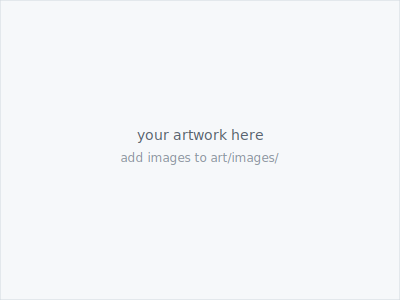

A collection of artworks I keep coming back to.

---

<!--
HOW TO ADD A NEW ARTWORK
========================
1. Save your image to art/images/  (jpg, png, or webp)
2. Copy one .art-item block below and fill in:
   - the image path  →  images/your-file.jpg
   - the title       →  artwork title
   - the credit line →  Artist Name, Year  (wrapped in [  ]{.art-caption})
-->

:::{.art-grid}

::::{.art-item}

**Your first artwork**
[Add an image to `art/images/` and update this page]{.art-caption}
::::

:::
