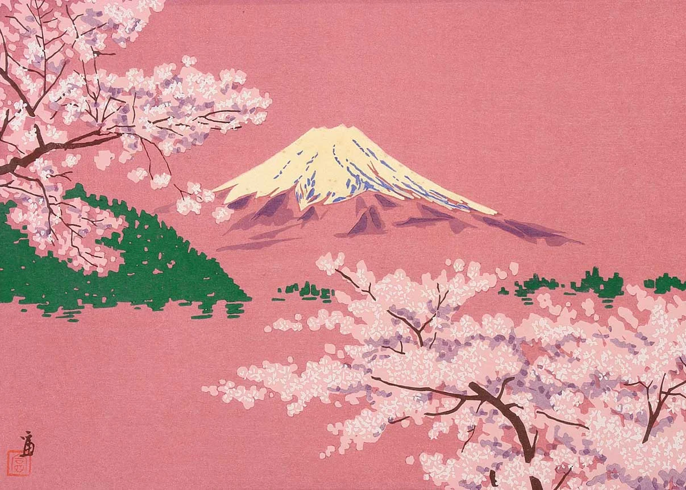

There is a flower I have never been able to keep. Lotus belongs to lakes and still water and the particular quality of light that finds it there. For years I thought of this as a frustration. Then I read Okakura Kazuko, and understood it as something else entirely.

Okakura wrote *The Book of Tea* in 1906, a slim essay addressed to a Western world he feared was misreading Japan. Tucked inside his meditation on the tea ceremony is a philosophy that goes well beyond the teacup. Respect the flower, he writes, by going to its home to see it. Not by plucking it for your own. The point is not about ownership in any narrow sense. It is about something older and harder to name: the human instinct to possess beauty rather than simply encounter it. To sever a thing from its context, bring it into your orbit, make it yours. Okakura suggests, quietly, that this instinct costs us something we do not notice losing.

Something similar has happened to music. A favorite song used to arrive on its own terms, on the radio, in a shop, drifting from somewhere you couldn't place. You couldn't summon it. And when it found you, time did something strange. It slowed. It folded back. Now we build playlists and listen on repeat, and the song remains but the encounter disappears. We have more access to beauty than any generation before us. We are also, perhaps, less often stopped in our tracks by it. The things we love most, I have come to understand, tend to resist being kept.

I have learned this in other ways too. I have moved across continents enough times to know that the people I love cannot be carried either. Friends left in cities I no longer live in, in seasons that no longer exist. I send love from afar and hold onto the hope of encounter, that we will find ourselves one day in the same place at the same time. That the hugs will feel just as warm, the conversation just as easy, the love just as present. That it will carry us back to when the friendship first blossomed, like cherry blossoms, brilliant and brief, and worth every moment of the missing.

I still can't grow lotus in my mother's garden. I go to it instead, when I can. Lakes, slow water, the right time of year. There is something it gives me there that it couldn't give me anywhere else, and I've learned not to ask too hard what that something is. Okakura knew. He just also knew it couldn't be explained to someone who had never stood at the water's edge and chosen, for once, not to reach.
